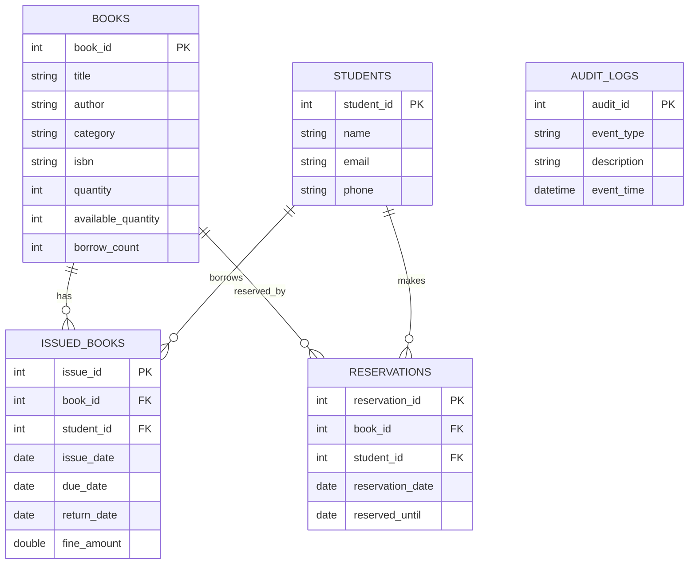
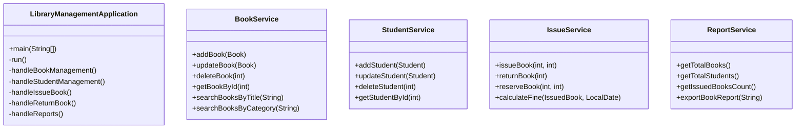

# Library Management System

A production-style Java console application for library operations, built using Java 17, JDBC, MySQL, Maven, JUnit 5, and Log4j2. The system demonstrates layered architecture, object-oriented principles, audit logging, fine calculation, reservation management, and CSV report export.

## Project Structure

```
LibraryManagementSystem/
├── src/main/java
│   ├── com/library/model
│   ├── com/library/dao
│   ├── com/library/dao/impl
│   ├── com/library/service
│   ├── com/library/util
│   ├── com/library/exception
│   └── com/library/main
├── src/main/resources
│   ├── db.properties
│   └── log4j2.xml
├── src/test/java
├── database/library.sql
├── docs
│   ├── ER_Diagram.md
│   ├── Class_Diagram.md
│   └── screenshots.md
├── pom.xml
└── README.md
```

## Architecture

The application follows a layered architecture:

- `model` — domain objects representing books, students, issued books, reservations, and audits.
- `dao` — persistence interfaces for separation of database logic.
- `dao.impl` — JDBC-based implementations using `PreparedStatement` and `try-with-resources`.
- `service` — business rules, validation, audit logging, and report generation.
- `util` — shared utilities for database connection, CSV export, and validation.
- `main` — menu-driven user interface for the console.

## OOP Concepts Demonstrated

- Encapsulation: model classes with private fields and public accessors.
- Inheritance/Abstraction: service layer hides persistence details behind DAO interfaces.
- Polymorphism: DAO implementations can be swapped without changing service logic.
- Clean code: separate responsibilities, meaningful names, modular methods.

## Database Schema

The MySQL schema is defined in `database/library.sql` and includes:

- `books` — catalog with available and total quantities.
- `students` — registered library members.
- `issued_books` — book issue and return tracking with fines.
- `reservations` — holds reservation requests for unavailable books.
- `audit_logs` — persistent audit trail of operations.

## Setup and Installation

### Prerequisites

- Java 17+
- MySQL server
- Maven

### Database Setup

1. Create the database and tables:

```bash
mysql -u root -p < database/library.sql
```

2. Update `src/main/resources/db.properties` with your MySQL credentials.

```properties
db.url=jdbc:mysql://localhost:3306/library_management?useSSL=false&serverTimezone=UTC
db.username=root
db.password=password
```

### Build the Project

If you have Maven installed:

```bash
mvn clean package
```

If Maven is unavailable, you can compile with a local `lib/` directory containing the runtime jars and use `javac` directly.

### Run the Application

Default MySQL runtime:

```bash
java -cp target/classes;lib/* com.library.main.LibraryManagementApplication
```

Run with H2 instead of MySQL (recommended when MySQL is unavailable):

```bash
java -cp target/classes;lib/* -Ddb.driver=org.h2.Driver -Ddb.url="jdbc:h2:./database/librarydb;MODE=MySQL;AUTO_SERVER=TRUE" -Ddb.username=sa -Ddb.password= -Ddb.initialize=true com.library.main.LibraryManagementApplication
```

> The `-Ddb.initialize=true` flag creates the schema automatically from `src/main/resources/schema/library.sql` when the database is empty.

## Running Tests

The project includes JUnit 5 tests covering:

- Add Book
- Search Book
- Issue Book
- Return Book
- Fine Calculation

Run tests with:

```bash
mvn test
```

## Features

- Book management: add, update, delete, search, list all, list available.
- Student management: add, update, delete, search, list all.
- Issue and return workflow with due dates and fine calculation.
- Prevent issuing unavailable books.
- Reservation support for unavailable books.
- Reports and CSV export for books, students, and active issues.
- Audit logging persisted to the database.
- Search books by category and most borrowed books report.

## Sample Console Output

```
=================================
LIBRARY MANAGEMENT SYSTEM
=================================
1. Book Management
2. Student Management
3. Issue Book
4. Return Book
5. Reports
6. Exit
Select an option: 
```

## Mermaid Diagrams

### ER Diagram



### Class Diagram



## Future Enhancements

- Add a dedicated web UI or REST API layer.
- Introduce role-based access control for librarians and admins.
- Add email notifications for overdue books and reservations.
- Support book categories, publishers, and book cover images.
- Provide pagination for large catalogs and export options for PDF.
