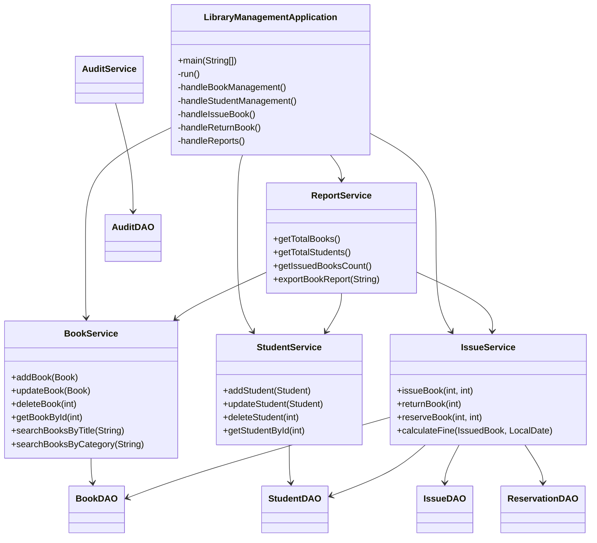

# Class Diagram

```mermaid
classDiagram
    class LibraryManagementApplication {
        +main(String[])
        -run()
        -handleBookManagement()
        -handleStudentManagement()
        -handleIssueBook()
        -handleReturnBook()
        -handleReports()
    }
    class BookService {
        +addBook(Book)
        +updateBook(Book)
        +deleteBook(int)
        +getBookById(int)
        +searchBooksByTitle(String)
        +searchBooksByCategory(String)
    }
    class StudentService {
        +addStudent(Student)
        +updateStudent(Student)
        +deleteStudent(int)
        +getStudentById(int)
    }
    class IssueService {
        +issueBook(int, int)
        +returnBook(int)
        +reserveBook(int, int)
        +calculateFine(IssuedBook, LocalDate)
    }
    class ReportService {
        +getTotalBooks()
        +getTotalStudents()
        +getIssuedBooksCount()
        +exportBookReport(String)
    }
    class BookDAO
    class StudentDAO
    class IssueDAO
    class ReservationDAO
    class AuditDAO

    LibraryManagementApplication --> BookService
    LibraryManagementApplication --> StudentService
    LibraryManagementApplication --> IssueService
    LibraryManagementApplication --> ReportService
    BookService --> BookDAO
    StudentService --> StudentDAO
    IssueService --> BookDAO
    IssueService --> StudentDAO
    IssueService --> IssueDAO
    IssueService --> ReservationDAO
    ReportService --> BookService
    ReportService --> StudentService
    ReportService --> IssueService
    AuditService --> AuditDAO
```
