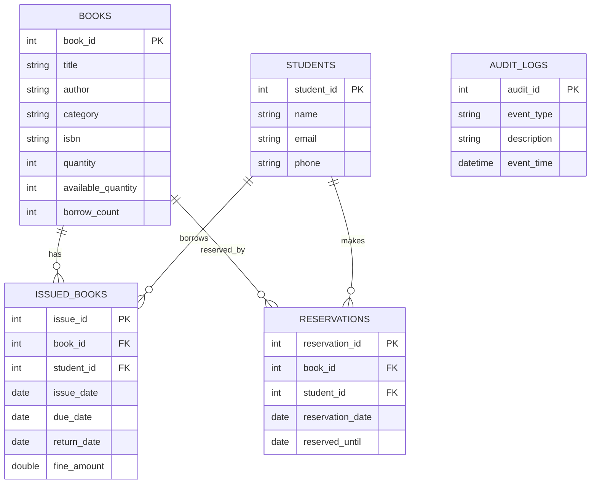

# ER Diagram

```mermaid
erDiagram
    BOOKS {
        int book_id PK
        string title
        string author
        string category
        string isbn
        int quantity
        int available_quantity
        int borrow_count
    }
    STUDENTS {
        int student_id PK
        string name
        string email
        string phone
    }
    ISSUED_BOOKS {
        int issue_id PK
        int book_id FK
        int student_id FK
        date issue_date
        date due_date
        date return_date
        double fine_amount
    }
    RESERVATIONS {
        int reservation_id PK
        int book_id FK
        int student_id FK
        date reservation_date
        date reserved_until
    }
    AUDIT_LOGS {
        int audit_id PK
        string event_type
        string description
        datetime event_time
    }

    BOOKS ||--o{ ISSUED_BOOKS : has
    STUDENTS ||--o{ ISSUED_BOOKS : borrows
    BOOKS ||--o{ RESERVATIONS : reserved_by
    STUDENTS ||--o{ RESERVATIONS : makes
    
```